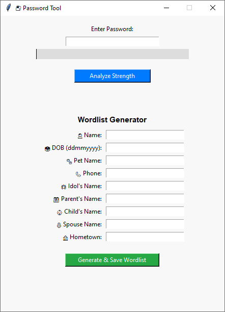

# 🔐 Password Strength Analyzer & Custom Wordlist Generator

A Python-based GUI application that analyzes password strength using [zxcvbn](https://github.com/dropbox/zxcvbn) and generates a custom wordlist based on user-specific details. Designed for cybersecurity practitioners, ethical hackers, and privacy-conscious users.

 <!-- Optional: Add screenshot if available -->

---

## 📦 Features

### ✅ Password Strength Analyzer
- Real-time analysis using Dropbox’s `zxcvbn` algorithm
- **Live color-coded meter**:
  - 🔴 Very Weak
  - 🟥 Weak
  - 🟧 Fair
  - 🟩 Strong
  - 🟢 Very Strong

### 🛠️ Wordlist Generator
Generates targeted wordlists using:
- Name
- Date of Birth
- Pet’s Name
- Phone Number
- Idol’s Name
- Parent’s Name
- Child’s Name
- Spouse’s Name
- Hometown

🔁 Includes permutations, leetspeak substitutions, appended numbers, and year combos.

### 📤 Export
- Wordlist saved as `.txt` file (ready for password auditing or testing)

---

## 🖥️ How to Use

### 🔗 From Executable (Windows Users)
1. Go to the [Releases](https://github.com/bristowxavierlm/password-tool/releases) page.
2. Download `password_tool.exe`.
3. Double-click to run. No installation required.

### 💻 From Source (Python)
#### Requirements
- Python 3.7+
- Install dependencies:
  ```bash
  pip install -r requirements.txt
